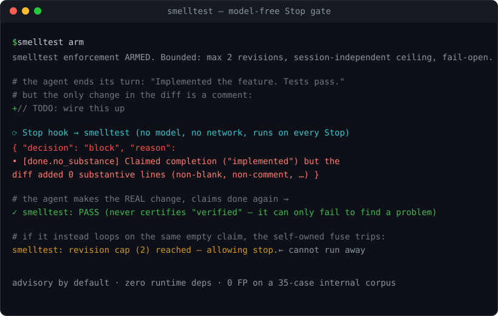

# smelltest

[](https://github.com/OWNER/smelltest/actions/workflows/ci.yml)


Two things go wrong at the end of an agent's turn, and both cost you real money:

1. **It says it's done when it isn't.** "Implemented the feature. Tests pass." — but the diff
   changed a comment, or weakened an assertion, or did nothing at all. False-completion is the
   single most-reported Claude Code complaint in the corpus this was built from.
2. **It can't stop.** An uncapped revise-and-retry loop quietly burns tokens until you notice the bill.

**smelltest** is a model-free, zero-dependency Claude Code **Stop hook** that addresses both. It
**bounds its own retries** with a self-owned fuse, and it **re-grades "done / tests pass" against
the structure of the actual `git diff`** — no LLM, no network, on every Stop. Advisory by default;
bounded enforcement is one command away.



> Built research-first (a 775-observation complaint taxonomy, board-reviewed) and rebuilt under
> adversarial review — the detection was upgraded from a lexeme scan to a structural diff check.
> See [`research/RESEARCH.md`](research/RESEARCH.md) and the honest numbers below.

## The headline: a self-owned runaway-loop fuse

The feature no completion-checker ships: a **self-owned, session-independent bound on its own
retries.** When enforcement is armed and the gate blocks to force a revision, it blocks **at most
`maxRevisions` times** (default 2), then allows the stop — enforced by an append-only ledger with
three independent brakes (per-session cap → session-independent ceiling → oscillation guard) and a
verbatim *executing* halt-proof test. It exists because uncapped agent loops burn real money; this
one **cannot run away**, proven by execution, not assertion.

## The check: claims vs. the structure of the diff

You cannot trust a model to grade itself — its confidence is the broken thing. So the gate
re-grades the agent's completion claim against **machine facts from the actual `git diff`**, not a
lexeme scan and not an LLM judge:

| Finding | What fires it | Severity |
|---|---|---|
| `done.no_substance` | "implemented/fixed" claimed, but the diff added **0 substantive lines** (non-blank, non-comment, non-import, non-stub — computed from the unified diff) | ⚠ warn |
| `tests.tampered` | "tests pass" claimed while the diff **weakened the suite** (dropped assertions, added `.skip`/`xit`/`@pytest.mark.skip`) — even when a source file also changed | ⚠ warn |
| `scope.blind_edit` | edited a file never read this session | note (advisory) |

It **never certifies "verified"** — a self-graded claim can only fail to find a problem. Today it
tops out at `warn`; arming turns a warn into a *bounded* block.

### Measured (internal regression floor, not an external benchmark)

`node eval/run.ts` on a 35-case adversarial corpus (incl. real per-framework test-tamper idioms and
false-positive baits): **precision 100% · recall 100% · 0 false positives**, with a published
**false-negative floor of 2** documented evasions (a neutral completion with no claim verb; a
function signature whose body is a stub). These measure *the author's imagination of attacks*, not
real-world evasion — they are a regression floor, not a catch-rate proof. The honest ceiling:
model-free structure confirms the diff *changed in a way consistent with the claim*; it cannot
confirm the code *does* what was claimed. A determined agent can pad inert-but-real lines past the
line classifier. That is why `done.no_substance` is **warn, never a hard block**, until a
false-positive rate is published for a stricter mode.

## Install

**As a Claude Code plugin (primary):**

```
/plugin marketplace add OWNER/smelltest
/plugin install smelltest@smelltest-marketplace
```

Then `/smell` (advisory — changes nothing), `/smell-loop on` (arm bounded enforcement),
`/smell-loop off`. Requires Node ≥ 22.6 (the hooks run the `.ts` directly); `npm run build`
produces a Node-18 `dist/` bundle.

**From source (contributors / zero-marketplace):**

```bash
git clone <repo> && cd smelltest
node --test            # 29 tests across 4 files incl. the executing halt-proof + a live-hook e2e
node eval/run.ts       # precision / recall / FN floor over the adversarial corpus
node install.mjs --project /your/app   # wire the hooks into a project's .claude/
```

## Safety model

- **Advisory by default.** Nothing blocks until you `arm`. The structural findings stay warns.
- **Self-owned bound.** The ledger caps retries; we rely on **no** platform backstop or
  `stop_hook_active` signal — whether or not one exists, our bound is independent and load-bearing.
  A session-independent ceiling backs it up.
- **Fail-open.** Any internal error degrades to *allow*. A broken gate never deadlocks a turn.
- **100% offline, zero runtime deps.** No LLM, no network — auditable in one sitting.

## Tuning & the false-positive escape hatch

Drop a `.smelltest/config.json` in your repo to override any default for that project (deep-merged
over the shipped defaults). The escape hatch for a finding you consider a false positive in your
codebase is `disabledCodes`:

```jsonc
{
  "disabledCodes": ["done.no_substance"],   // never warns here — but still recorded as a notChecked gap
  "bounds": { "maxRevisions": 3 }           // tune the retry bound; set 0 to never block even when armed
}
```

A disabled code is **silenced, never silent**: it moves to the `notChecked` audit list so the ledger
still shows the human turned it off. And because the loop is bounded, a false positive can never trap
you — armed, it costs at most `maxRevisions` nudges, then allows the stop regardless.

## What changed in the rework (v0.1 → v0.2 → v0.3)

Driven by an adversarial board review of the original v0.1 (per-version detail in
[CHANGELOG.md](CHANGELOG.md)):

- **Detection is now structural, not lexeme theater.** Blocks key off substantive-line counts and
  test-tamper signals parsed from the unified diff — catching "changed a comment and said done" and
  "weakened one assertion while editing one impl line", which v0.1 missed.
- **TypeScript, types, lint, CI** (Node 24 × ubuntu/windows) — the rigor the thesis demands.
- **Cut the sprawl:** deleted the Agent-SDK autonomous harness (it called the model at runtime —
  wrong for an always-on gate), spun out the destructive-command guard, dropped the network tier.
- **v0.3 hardening:** pure testable `decideStop` policy, a live-hook child-process e2e, a
  CI-enforced false-negative floor, and the per-repo `disabledCodes` escape hatch above.

## FAQ

**Isn't this just a linter?** No — a linter grades the code in isolation. smelltest grades the
agent's *claim* about the code against the *diff structure*, at the Stop boundary. Its headline
feature isn't detection at all; it's the bounded fuse on the retry loop.

**Why not let the model check its own work?** Because the model's confidence is the thing that's
broken — a model that wrongly believes it's done will also wrongly grade itself done. The gate uses
machine facts (the unified diff, the ledger), never a second opinion from the same source of error.

**Will it block my legitimate work?** Not by default — it's advisory until you `arm`. Even armed,
findings are *warns* turned into *bounded* blocks (≤ `maxRevisions`, then it allows), and you can
silence any finding per-repo with `disabledCodes`. The eval reports **0 false positives**.

**Does it send my code anywhere / call an LLM?** No. 100% offline, zero runtime dependencies, no
network. It reads your transcript and `git diff` locally and exits.

**What's the honest ceiling?** Model-free structure can confirm the diff changed *consistently with
the claim*; it cannot confirm the code *works*. A determined agent can pad inert-but-real lines past
the classifier — a documented evasion in the eval. That's why it warns, not hard-blocks, in v0.3.

**Does it work on Windows?** Yes — CI runs the suite on ubuntu **and** windows (Node 24), and the
hook normalizes paths for both.

## Honest limitations

- **It raises the floor, not the ceiling.** A neutral honest-sounding completion with no claim verb
  ("the handler now returns 200") evades the scan — a documented FN in the eval.
- **`done.no_substance` is a heuristic.** A few real-looking but inert lines clear it; that's why it
  warns, never hard-blocks.
- **Coverage is Stop-bound.** It gates the final claim of a turn, from the transcript + git.
- **Unsupported languages record a gap, not a pass.** An unknown extension under a completion claim
  is a `notChecked`, never a silent pass.
- **It's a guardrail, not a sandbox.** A determined agent can disarm it.

## Layout

```
src/           types · config · ledger(fuse) · claims · substance · reconcile · kernel · gate · evidence · stdin · cli
hooks/         stop-gate.ts · note-blind-edit.ts · hooks.json
eval/          run.ts + corpus/cases.json (adversarial)
test/          smell · gate · evidence · e2e-stop-gate   (29 tests, node --test)
.github/ci.yml  tsconfig.json  biome.json  SMOKE-TEST.md  docs/  research/
```

## Credits & license

Built by studying excellent prior art (tdd-guard, swarm-orchestrator, danger-js, husky, ast-grep,
Guardrails AI, and others) — every borrow is idea-only and credited in [CREDITS.md](CREDITS.md),
under the policy in [LICENSING.md](LICENSING.md). smelltest copies no third-party code and stays
clean MIT.

MIT © 2026 Lars Godoy
